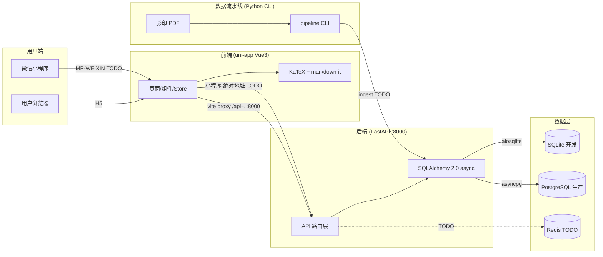

# 系统架构文档

> 量化面试刷题题库平台 — 系统架构与技术设计
> 版本：v1.0 | 更新日期：2026-06-29

---

## 一、系统架构图



---

## 二、技术栈

### 2.1 已集成

| 层 | 技术 | 版本 | 用途 |
|----|------|------|------|
| 前端框架 | uni-app | 3.0.0 | Vue3 + Vite + TS，双端编译 |
| 状态管理 | Pinia | ^3.0.4 | 组合式 store |
| 公式渲染 | KaTeX | ^0.16 | LaTeX 渲染（28KB gzip） |
| Markdown | markdown-it | ^14 | 题干/解析 Markdown 解析 |
| LaTeX 插件 | @traptitech/markdown-it-katex | ^3 | `$...$`/`$$...$$` 公式支持 |
| 后端框架 | FastAPI | ≥0.115 | 异步 API 框架 |
| ORM | SQLAlchemy | 2.0+ async | 异步数据库操作 |
| 数据校验 | Pydantic | v2 | 请求/响应模型 |
| 配置 | pydantic-settings | ≥2.0 | 环境变量管理 |
| 开发数据库 | SQLite | — | aiosqlite 异步驱动 |

### 2.2 待集成（TODO）

| 技术 | 用途 | 对应任务 |
|------|------|---------|
| PostgreSQL + asyncpg | 生产数据库 | B12 部署 |
| Redis 7 | 缓存/计时/限流 | B12 部署 |
| pg_jieba + PG FTS | 中文全文搜索 | B8 搜索（当前用 LIKE） |
| PaddleOCR PP-OCRv4 | OCR 文字识别 | A2-A4 |
| PP-FormulaNet-S | OCR 公式识别 | A4 |
| PP-StructureV3 | 版面分析 | A3 |
| SimHash + MinHash | 题目去重 | A8 |
| Alembic | 数据库迁移 | A10 |
| Docker Compose | 容器化部署 | B12 |
| Nginx | 反向代理 | B12 |

---

## 三、前端架构

### 3.1 分层结构

```
frontend/src/
├── pages/           # 6 个页面（路由）
│   ├── index/       # 首页：题量统计 + 快捷入口
│   ├── list/        # 题库列表：筛选 + 分页 + 骨架屏
│   ├── detail/      # 详情作答：题干渲染 + 作答 + 判定 + 解析 + 收藏 + 计时
│   ├── search/      # 搜索：300ms 防抖
│   ├── favorites/   # 收藏列表
│   └── settings/    # 夜间模式 + 字体调节
├── components/      # 4 个组件
│   ├── FormulaText.vue   # 核心：Markdown + LaTeX 渲染
│   ├── QuestionCard.vue  # 列表卡片
│   ├── DifficultyTag.vue # P1-P5 色阶标签
│   └── EmptyState.vue    # 空状态
├── stores/          # 3 个 Pinia store
│   ├── question.ts  # 列表/筛选/详情/作答状态
│   ├── favorite.ts  # 收藏列表 + ID 集合缓存
│   └── settings.ts  # 主题/字体/device_id 持久化
├── api/             # HTTP 请求层
│   ├── request.ts   # uni.request 统一封装（双端通用）
│   ├── question.ts  # ⚠️ 剥离 is_correct 防答案泄露
│   ├── favorite.ts  # 收藏 toggle + 列表
│   ├── source.ts    # 来源
│   └── tag.ts       # 标签
├── types/
│   └── api.ts       # 与后端 Schema 严格对齐的 TS 类型
└── utils/
    ├── markdown.ts  # markdown-it + KaTeX 单例
    ├── difficulty.ts # P1-P5 色阶 + 题型中文映射
    └── device.ts    # device_id 生成（crypto.randomUUID）
```

### 3.2 关键设计

**is_correct 安全剥离**：
- 后端 `QuestionDetail.options[].is_correct` 包含正确答案
- 前端 `api/question.ts#getQuestionDetail()` 在 API 层剥离，返回 `SafeQuestionDetail`
- UI 层（store/page/component）只持有 `SafeQuestionDetail`，防止作答前答案泄露
- 详见 [API 文档 §五](./api-reference.md#五is_correct-安全机制)

**请求封装**：
- `request.ts` 基于 `uni.request`（H5 底层 XHR，小程序原生），双端通用零依赖
- `BASE_URL='/api'`（H5 走 vite 代理；小程序需条件编译切绝对地址 TODO）
- 兼容两种后端错误格式（`{detail}` / `{code,message,detail}`），自动 `uni.showToast`

---

## 四、后端架构

### 4.1 分层结构

```
backend/app/
├── main.py          # FastAPI 入口：CORS + 全局异常 + 健康检查 + 路由挂载
├── config.py        # pydantic-settings 配置（.env 支持）
├── database.py      # async engine + session + Base
├── api/             # 路由层
│   ├── deps.py      # 依赖注入（DB session + 分页参数）
│   ├── questions.py # 4 端点：列表/详情/搜索/作答
│   ├── favorites.py # 2 端点：toggle/列表
│   ├── sources.py   # 1 端点：来源列表
│   └── tags.py      # 1 端点：标签列表
├── models/          # SQLAlchemy 模型（8 张表）
│   ├── question.py  # Question + Option + Solution
│   ├── interaction.py # AttemptLog + Favorite
│   ├── source.py    # Source
│   └── tag.py       # Tag + question_tags 关联表
└── schemas/         # Pydantic 请求/响应模型
    ├── question.py  # 全部业务 Schema
    └── common.py    # PageResponse + ErrorResponse
```

### 4.2 关键设计

**异步栈**：FastAPI 全异步 + SQLAlchemy 2.0 async + aiosqlite/asyncpg
**ORM 加载**：默认 `lazy="selectin"` 避免 N+1；详情页显式 `selectinload` 预加载关联
**建表**：当前用 `Base.metadata.create_all()`（开发够用），生产需 Alembic 迁移（TODO）
**全局异常**：未处理异常返回 `{code:500, message, detail?}`，`detail` 仅 DEBUG 模式返回

---

## 五、双端适配方案

| 维度 | H5（已实现） | 微信小程序（TODO） |
|------|-------------|-------------------|
| 公式渲染 | KaTeX 直接渲染（v-html） | 后端预渲染 HTML + rich-text（未实现） |
| API 请求 | `/api` 经 vite 代理 | `BASE_URL` 切绝对地址（未实现） |
| 条件编译 | `#ifdef H5` | `#ifdef MP-WEIXIN`（已预留占位） |
| 编译命令 | `pnpm dev:h5` | `pnpm dev:mp-weixin`（命令存在，未验证） |

**FormulaText.vue** 已用 `#ifdef` 条件编译预留小程序分支（`rich-text` + `safeHtml` 空占位），真正实现需后端加预渲染接口。

---

## 六、数据流水线架构

```
PDF → render(渲染+扫描判定) → ocr(版面分析+分流OCR) → split(题目边界)
    → link(答案关联) → dedup(去重) → ingest(入库)
```

**当前状态**：CLI 脚手架阶段，6 命令全 TODO 占位。详见 [pipeline/README.md](../pipeline/README.md)。

---

## 七、已知缺口与风险

| 缺口 | 风险等级 | 说明 | 对应任务 |
|------|---------|------|---------|
| is_correct 服务端未剥离 | **高** | 直接调 API 可拿选择题答案 | TODO 后端修复 |
| 无 Alembic 迁移 | 中 | 生产环境 schema 变更无版本控制 | A10 |
| 无 Docker / 部署配置 | 中 | 无法容器化部署 | B12 |
| 无测试文件 | 中 | 零测试覆盖 | — |
| 搜索用 LIKE | 低 | 性能差，万级数据可接受 | B8（切 PG FTS） |
| 无审核后台 | 中 | OCR 题目无法人工审核发布 | A9 |
| 流水线未实现 | 高 | 无法从 PDF 自动入库 | A2-A10 |
