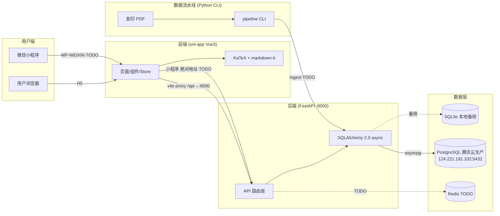

# 系统架构文档

> 量化面试刷题题库平台 — 系统架构与技术设计
> 版本：v1.3 | 更新日期：2026-07-08（M2-M5 功能全量落地）

---

## 一、系统架构图



---

## 二、技术栈

### 2.1 已集成

| 层 | 技术 | 版本 | 用途 |
|----|------|------|------|
| 前端框架 | uni-app | 3.0.0 | Vue3 + Vite + TS，双端编译 |
| 状态管理 | Pinia | ^3.0.4 | 组合式 store |
| 公式渲染 | KaTeX | ^0.16 | LaTeX 渲染（28KB gzip） |
| Markdown | markdown-it | ^14 | 题干/解析 Markdown 解析 |
| LaTeX 插件 | @traptitech/markdown-it-katex | ^3 | `$...$`/`$$...$$` 公式支持 |
| 后端框架 | FastAPI | ≥0.115 | 异步 API 框架 |
| ORM | SQLAlchemy | 2.0+ async | 异步数据库操作 |
| 数据校验 | Pydantic | v2 | 请求/响应模型 |
| 配置 | pydantic-settings | ≥2.0 | 环境变量管理 |
| 开发数据库 | SQLite | — | 本地备用，生产已切 PG |
| 生产数据库 | PostgreSQL 16 | — | 腾讯云 CVM，asyncpg 驱动 |

### 2.2 待集成（TODO）

| 技术 | 用途 | 对应任务 |
|------|------|---------|
| Redis 7 | 缓存/计时/限流 | B12 部署 |
| pg_jieba + PG FTS | 中文全文搜索 | 当前 pg_trgm 相似度排序已够用，中文语料多时再升级 |
| PaddleOCR PP-OCRv4 | OCR 文字识别 | A2-A4 |
| PP-FormulaNet-S | OCR 公式识别 | A4 |
| PP-StructureV3 | 版面分析 | A3 |
| SimHash + MinHash | 题目去重 | A8 |
| Alembic | 数据库迁移 | A10 |
| Docker Compose | 容器化部署 | B12 |

---

## 三、前端架构

### 3.1 分层结构

```
frontend/src/
├── pages/           # 10 个页面（路由）
│   ├── index/       # 首页：每日一题 + 进度 + 智能刷题/模考等快捷入口
│   ├── list/        # 题库列表：筛选（URL 持久化）+ 分页 + 随机悬浮按钮
│   ├── detail/      # 详情作答：渲染 + 判定 + 解析 + 收藏 + 笔记
│   ├── search/      # 搜索：300ms 防抖（后端相关性排序）
│   ├── favorites/   # 收藏列表
│   ├── profile/     # 我的（tab）：用户卡片 + 进度统计 + 入口
│   ├── wrong/       # 错题本：已掌握标记
│   ├── exam/        # 模考：配置/作答/报告三态
│   ├── login/       # 手机验证码登录
│   └── settings/    # 夜间模式 + 字体 + 账号区
├── components/      # 4 个组件
│   ├── FormulaText.vue   # 核心：Markdown + LaTeX 渲染
│   ├── QuestionCard.vue  # 列表卡片
│   ├── DifficultyTag.vue # P1-P5 色阶标签
│   └── EmptyState.vue    # 空状态
├── stores/          # 5 个 Pinia store
│   ├── question.ts  # 列表/筛选/详情/作答状态
│   ├── favorite.ts  # 收藏列表 + ID 集合缓存
│   ├── auth.ts      # 登录态/token/绑定设备（M2）
│   ├── attempt.ts   # 本地做题状态
│   └── settings.ts  # 主题/字体/device_id 持久化
├── api/             # HTTP 请求层
│   ├── request.ts   # uni.request 统一封装（双端通用）
│   ├── question.ts  # 题目详情/列表请求
│   ├── favorite.ts  # 收藏 toggle + 列表
│   ├── source.ts    # 来源
│   └── tag.ts       # 标签
├── types/
│   └── api.ts       # 与后端 Schema 严格对齐的 TS 类型
└── utils/
    ├── markdown.ts  # markdown-it + KaTeX 单例
    ├── difficulty.ts # P1-P5 色阶 + 题型中文映射
    └── device.ts    # device_id 生成（crypto.randomUUID）
```

### 3.2 关键设计

**is_correct 服务端剥离**（v2.1 起）：
- 后端 `OptionOut` Schema 已移除 `is_correct` 字段，正确答案不出网
- 判分统一走 `POST /attempts`，由服务端 `app/utils/answer_match.py` 判定
- 前端类型 `OptionOut` 同步移除该字段，无需客户端剥离逻辑

**请求封装**：
- `request.ts` 基于 `uni.request`（H5 底层 XHR，小程序原生），双端通用零依赖
- `BASE_URL='/api'`（H5 走 vite 代理/生产 Nginx 同域反代）；自动注入 Bearer token，401 静默 refresh 重试
- 兼容两种后端错误格式（`{detail}` / `{code,message,detail}`），自动 `uni.showToast`

---

## 四、后端架构

### 4.1 分层结构

```
backend/app/
├── main.py          # FastAPI 入口：CORS + 全局异常 + 健康检查 + 路由挂载
├── config.py        # pydantic-settings 配置（.env 支持）
├── database.py      # async engine + session + Base
├── api/             # 路由层
│   ├── deps.py      # 依赖注入（DB session + 分页 + get_current_user[_optional]）
│   ├── questions.py # 列表/每日一题/随机(smart)/详情/搜索/作答/笔记/已掌握/举报
│   ├── favorites.py # toggle/列表（登录态写 user_id）
│   ├── auth.py      # 验证码发送/登录注册/refresh（M2）
│   ├── users.py     # me/资料编辑/绑定设备/统计/错题本（M2+M3）
│   ├── exam.py      # 模考 start/submit（M4）
│   ├── sources.py   # 来源列表（5min 内存缓存）
│   ├── tags.py      # 标签列表（5min 内存缓存）
│   ├── admin.py     # 管理后台
│   └── stats.py     # 全局统计
├── models/          # SQLAlchemy 模型（14 张表）
│   ├── question.py  # Question + Option + Solution
│   ├── interaction.py # AttemptLog/Favorite/QuestionReport/Note/MasteredQuestion/ExamSession
│   ├── user.py      # User + VerificationCode（M2）
│   ├── source.py    # Source
│   └── tag.py       # Tag + question_tags 关联表
├── utils/
│   ├── answer_match.py # 答案判定（数值等价/备选展开，16 单测）
│   ├── security.py  # JWT 签发/校验（HS256，access 7d + refresh 30d）
│   └── sms.py       # 短信 Provider（dev 可插拔，ICP 后接腾讯云）
└── schemas/         # Pydantic 请求/响应模型
    ├── question.py  # 题目业务 Schema
    ├── auth.py      # 账号 Schema（M2）
    └── common.py    # PageResponse + ErrorResponse
```

**身份体系（M2 起）**：所有个人数据接口双身份——登录用户走 JWT `Authorization: Bearer`（user_id），
匿名走 `device_id` 参数；登录时自动把设备历史记录绑定到账号。

**学习闭环（M3+M5）**：作答 → 错题本（最近一次为准，答对/标已掌握移出，答错回归）→
统计（正确率/今日/streak/题型分布）→ 智能刷题（错题>未做>随机）→ 每日一题（日期 hash 全站统一）→
笔记（详情页，空即删）→ 模考（exam_sessions，服务端判分，计入 attempt_logs）。

### 4.2 关键设计

**异步栈**：FastAPI 全异步 + SQLAlchemy 2.0 async + aiosqlite/asyncpg
**ORM 加载**：默认 `lazy="selectin"` 避免 N+1；详情页显式 `selectinload` 预加载关联
**建表**：`Base.metadata.create_all()` 启动自动建**新表**；已有表加列需手动跑 `backend/migrations/*.sql`（001=user_id 列，002=solutions trgm 索引），Alembic 接入仍是 TODO
**搜索**：PG 用 pg_trgm `similarity()` 相关性排序（GIN 索引），SQLite 回退 id 排序
**全局异常**：未处理异常返回 `{code:500, message, detail?}`，`detail` 仅 DEBUG 模式返回

---

## 五、双端适配方案

| 维度 | H5（已实现） | 微信小程序（TODO） |
|------|-------------|-------------------|
| 公式渲染 | KaTeX 直接渲染（v-html） | 后端预渲染 HTML + rich-text（未实现） |
| API 请求 | `/api` 经 vite 代理 | `BASE_URL` 切绝对地址（未实现） |
| 条件编译 | `#ifdef H5` | `#ifdef MP-WEIXIN`（已预留占位） |
| 编译命令 | `pnpm dev:h5` | `pnpm dev:mp-weixin`（命令存在，未验证） |

**FormulaText.vue** 已用 `#ifdef` 条件编译预留小程序分支（`rich-text` + `safeHtml` 空占位），真正实现需后端加预渲染接口。

---

## 六、数据流水线架构

```
PDF → render(渲染+扫描判定) → ocr(版面分析+分流OCR) → split(题目边界)
    → link(答案关联) → dedup(去重) → ingest(入库)
```

**当前状态**：CLI 脚手架阶段，6 命令全 TODO 占位。详见 [pipeline/README.md](../pipeline/README.md)。

---

## 七、已知缺口与风险

| 缺口 | 风险等级 | 说明 | 对应任务 |
|------|---------|------|---------|
| 无 Alembic 迁移 | 中 | 生产环境 schema 变更无版本控制 | A10 |
| 无 Docker | 低 | 已有 systemd + Nginx（deploy/ 目录），未容器化 | B12 |
| 密码明文在 .env | 中 | DB 密码硬编在 backend/.env，需改用腾讯云密钥管理或环境变量注入 | — |
| 测试覆盖低 | 中 | 仅 answer_match 有单测（16 例），API 层零覆盖 | — |
| 无审核后台 | 中 | OCR 题目无法人工审核发布 | A9 |
| 流水线未实现 | 高 | 无法从 PDF 自动入库 | A2-A10 |
